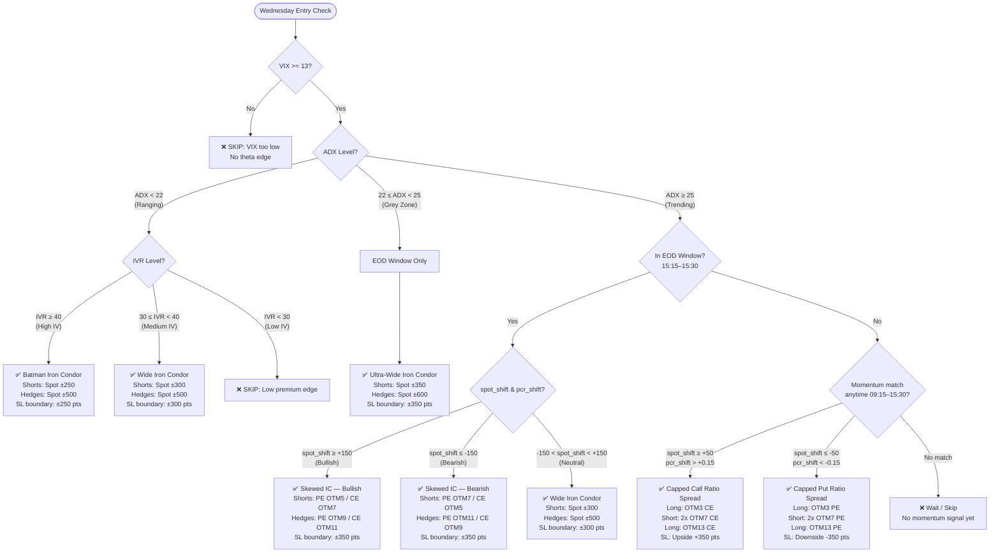
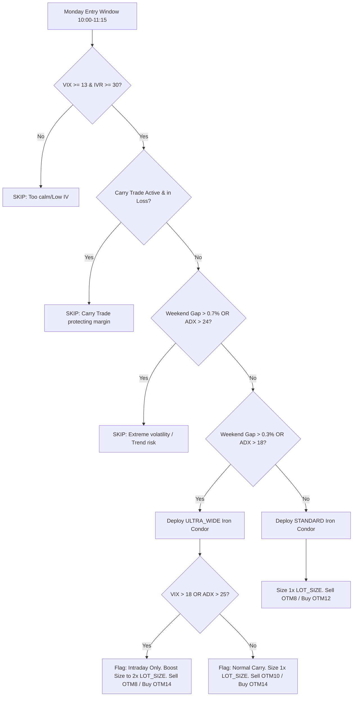
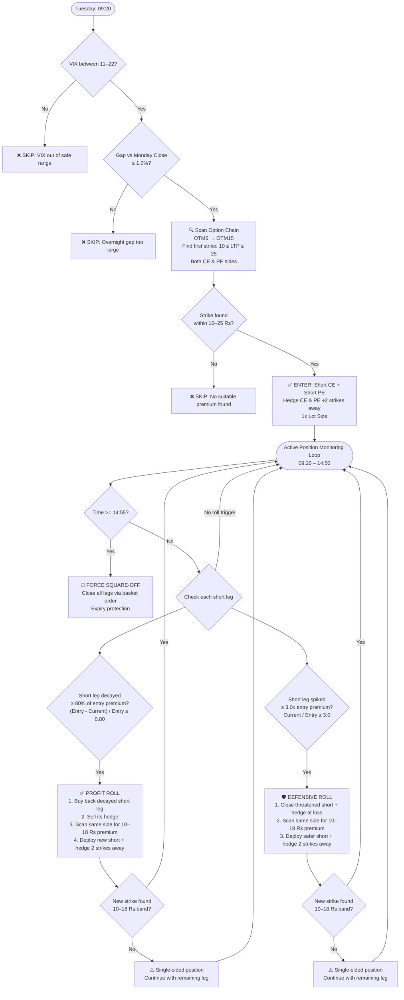

# Nifty Weekly Master Strategy — Strategy Manual & Trade Rules (v2.1 Precision)

This document provides a comprehensive, itemized reference for every trading case, execution gate, and entry/exit condition implemented in [nifty_weekly_master.py](file:///c:/Users/Kush%20Tejani/Downloads/openalgo_v2.1/openalgo/nifty_weekly_master.py).

---

## ⚙️ Global Parameters & Configuration

| Parameter | Configuration Value | Description |
| :--- | :--- | :--- |
| **Underlying Instrument** | `NIFTY` | Underlying index name |
| **Exchanges** | `NSE_INDEX` (Index), `NFO` (Derivatives) | OpenAlgo target exchanges |
| **Product Type** | `NRML` | Allows positions to carry forward overnight |
| **Lot Size** | `65` qty | Multiplier per option contract |
| **Strike Step** | `50` points | Nifty strike price interval |
| **Capital Basis** | `Rs. 2,00,000` | Account capital size for risk calculation |
| **Weekly Limit** | `Rs. 4,000` (`2%` of Capital) | Strategy weekly loss cap |
| **Average Weekly Prem**| `Rs. 32,500` (`500 * LOT_SIZE`) | Expected premium collection |
| **Weekly SL Mult** | `3.0x` | Multiplier for the Global Weekly Circuit Breaker |

---

## 🛡️ Global Risk Shields (Runs Every Cycle)

Regardless of the day or active trade type, the strategy executes a security monitor on every loop tick (300s):

### 1. Global Weekly Circuit Breaker
* **Trigger Condition**: Accumulated weekly loss exceeds $3.0 \times$ the average weekly premium.
  $$\text{weekly\_pnl} < -(\text{WEEKLY\_SL\_MULT} \times \text{AVG\_WEEKLY\_PREM}) = -\text{Rs. } 97,500$$
* **Action**:
  1. Immediately squares off all active slots (`carry_trade`, `monday_trade`, `tuesday_trade`) by placing opposite market orders.
  2. Sets `week_blocked = True` in state.
  3. Halts all strategy actions and entries for the remainder of the trading week.

### 2. Hard ITM Breach Exit
Active positions are monitored against extreme spot moves to prevent tail risk:
* **Butterfly / Straddle (Neutral ATM short-based)**:
  * Hard exit triggered if the Nifty Spot shifts $\ge 50$ points away from the initial entry strike:
    $$\text{Spot} > \text{strike} + 50 \quad \text{OR} \quad \text{Spot} < \text{strike} - 50$$
* **Iron Condor / Batman (OTM short-based)**:
  * Hard exit triggered if the Nifty Spot touches or crosses the outer short strikes (defined by the `short_offset` parameter):
    $$\text{Spot} > \text{strike} + \text{short\_offset} \quad \text{OR} \quad \text{Spot} < \text{strike} - \text{short\_offset}$$
* **Capped Call Ratio Spread**:
  * Hard exit triggered only on the upside (since the downside has zero risk):
    $$\text{Spot} > \text{strike} + \text{short\_offset}$$
* **Capped Put Ratio Spread**:
  * Hard exit triggered only on the downside (since the upside has zero risk):
    $$\text{Spot} < \text{strike} - \text{short\_offset}$$

### 3. Premium-Based Trailing Stop Loss
* **Carry Trade SL**: Exits the position if the net PnL drops to $\le -1.5\times$ of the premium collected credit.
* **Monday Trade SL**: Exits the position if the net PnL drops to $\le -1.2\times$ of the premium collected credit.
* **Tuesday Trade SL**: Tuesday trades do not have an automated premium-based stop loss; they are designed to be ridden to expiry or managed by rolls.
* **Data Lag Safeguard**: If any active option contract quote returns $\le 0$, the premium SL evaluation is skipped for that cycle to prevent false/panic exits due to broker data feed lag.
* *Note: Take Profit (TP) auto-exits are disabled to allow the user to manage profit capture manually.*

---

## 📅 Weekly Strategy Execution Timeline

```mermaid
gantt
    title Nifty Weekly Strategy Matrix
    dateFormat  X
    axisFormat %d
    section Wednesday
    Wednesday Close Recording :active, 0, 10
    Wednesday Carry Entry (EOD & Intra) :active, 5, 10
    section Monday
    Gap Settlement & Entry (10:00-11:15) :active, 20, 25
    Monday Close Recording (15:20-15:25) :active, 29, 30
    section Tuesday
    Expiry IC Entry (09:20-12:00) :active, 35, 45
    Intraday Rolling / Adjustments (All Day) :active, 40, 55
    Force Square-off (14:55) :crit, 55, 56
```

---

## 🟢 Wednesday — Regime-Based Carry Trade (Overnight)

* **Pre-requisite Gate**: India VIX must be $\ge 13$ (prevents entering when options lack theta edge).
* **Execution Window**: Triggers between `15:15` and `15:30` (EOD window) for ranging structures. Trend-following ratio spreads can trigger **anytime** (09:15 - 15:30) if dynamic momentum matches.
* **Day-Start Anchoring**: PCR and Spot are recorded at the start of the day to compute:
  * $\text{spot\_shift} = \text{Spot} - \text{morning\_spot}$
  * $\text{pcr\_shift} = \text{PCR} - \text{morning\_pcr}$

### Wednesday Entry Decision Tree

### Wednesday Strategy Selection Matrix

| Regime & ADX | IV Regime | Spot / PCR Momentum Shifts | Trade Setup Deployed | Strikes & Leg Construction | Safety Breach Boundary (`short_offset`) |
| :--- | :--- | :--- | :--- | :--- | :--- |
| **Ranging (Regime 1)** $\text{ADX} < 22$ | **High IV** $\text{IVR} \ge 40$ | EOD window only (no momentum required) | **Batman Iron Condor** (1x Size) | **Shorts**: OTM5 CE / PE (Spot $\pm 250$) **Hedges**: OTM10 CE / PE (Spot $\pm 500$) | $\pm 250$ pts (`5 * STRIKE_STEP`) |
| **Ranging (Regime 2)** $\text{ADX} < 22$ | **Medium IV** $30 \le \text{IVR} < 40$ | EOD window only (no momentum required) | **Wide Iron Condor** (1x Size) | **Shorts**: OTM6 CE / PE (Spot $\pm 300$) **Hedges**: OTM10 CE / PE (Spot $\pm 500$) | $\pm 300$ pts (`6 * STRIKE_STEP`) |
| **Ranging (Skip)** $\text{ADX} < 22$ | **Low IV** $\text{IVR} < 30$ | EOD window | **No Trade (Skipped)** | Skip due to low premium edge | N/A |
| **Grey Zone (Regime 1.5)** $22 \le \text{ADX} < 25$ | Any IV | EOD window only | **Ultra-Wide Iron Condor** (1x Size) | **Shorts**: OTM7 CE / PE (Spot $\pm 350$) **Hedges**: OTM12 CE / PE (Spot $\pm 600$) | $\pm 350$ pts (`7 * STRIKE_STEP`) |
| **Trending (Regime 3)** $\text{ADX} \ge 25$ | Any IV | $\text{spot\_shift} \ge +50$ pts $\text{pcr\_shift} > +0.15$ | **Capped Call Ratio Spread** (1x/2x Size) | **Long**: 1x OTM3 CE (Spot $+ 150$) **Short**: 2x OTM7 CE (Spot $+ 350$) **Long**: 1x OTM13 CE (Spot $+ 650$) | Upside: $+350$ pts (`7 * STRIKE_STEP`) |
| **Trending (Regime 4)** $\text{ADX} \ge 25$ | Any IV | $\text{spot\_shift} \le -50$ pts $\text{pcr\_shift} < -0.15$ | **Capped Put Ratio Spread** (1x/2x Size) | **Long**: 1x OTM3 PE (Spot $- 150$) **Short**: 2x OTM7 PE (Spot $- 350$) **Long**: 1x OTM13 PE (Spot $- 650$) | Downside: $-350$ pts (`7 * STRIKE_STEP`) |
| **EOD Fallback (Bullish)** $\text{ADX} \ge 25$ | Any IV | $\text{spot\_shift} \ge +150$ pts | **Skewed Iron Condor** (1x Size) | **Shorts**: OTM5 PE / OTM7 CE (Spot $-250$ / Spot $+350$) **Hedges**: OTM9 PE / OTM11 CE (Spot $-450$ / Spot $+550$) | $\pm 350$ pts (`7 * STRIKE_STEP`) |
| **EOD Fallback (Bearish)** $\text{ADX} \ge 25$ | Any IV | $\text{spot\_shift} \le -150$ pts | **Skewed Iron Condor** (1x Size) | **Shorts**: OTM7 PE / OTM5 CE (Spot $-350$ / Spot $+250$) **Hedges**: OTM11 PE / OTM9 CE (Spot $-550$ / Spot $+450$) | $\pm 350$ pts (`7 * STRIKE_STEP`) |
| **EOD Fallback (Neutral)** $\text{ADX} \ge 25$ | Any IV | $-150 < \text{spot\_shift} < +150$ pts | **Wide Iron Condor** (1x Size) | **Shorts**: OTM6 CE / PE (Spot $\pm 300$) **Hedges**: OTM10 CE / PE (Spot $\pm 500$) | $\pm 300$ pts (`6 * STRIKE_STEP`) |

---

## 🔵 Monday — Weekend Gap Player (Adaptive IC)

* **Execution Window**: Entry is scanned between `10:00` and `11:15` to allow early morning gap volatility to settle.
* **Pre-requisite Entry Gates**:
  1. VIX must be $\ge 13$.
  2. IVR must be $\ge 30$.
  3. Carry trade PnL check: If the Wednesday carry trade is still active, it must not be in a loss state ($\ge 0$).
* **Weekend Gap Calculation**:
  $$\text{gap\_pct} = \frac{|\text{Monday Open} - \text{Friday Close}|}{\text{Friday Close}} \times 100$$
  *(Note: Friday close is anchored between `15:20` and `15:26` on Friday afternoon).*

### Monday Decision Rules

---

## 🟡 Tuesday — Expiry Machine (Smart Adaptive IC)

* **Execution Window**: Entry scanned between `09:20` and `12:00`.
* **Pre-requisite Entry Gates**:
  1. VIX must be within the safe range: $11 \le \text{VIX} \le 22$.
  2. The gap between Monday's Close and Tuesday's Spot must be $\le 1.0\%$:
     $$\text{gap\_pct} = \frac{|\text{Tuesday Spot} - \text{Monday Close}|}{\text{Monday Close}} \times 100 \le 1.0\%$$

### 1. Smart Entry Selection
Instead of selling fixed strikes, the script dynamically scans Nifty Option Chain premiums:
* **Search Method**: Iterates through strikes starting from `OTM6` outwards to `OTM15` on both Call (CE) and Put (PE) sides.
* **Premium Target Band**: Finds the first strike whose current Last Traded Price (LTP) is between **10 Rs** and **25 Rs**:
  $$10 \le \text{Option Premium} \le 25$$
* **Hedge Placement**: Fixed hedges are placed exactly **2 strikes away** (100 points) from the chosen short strikes.
* **Position Size**: Standard `1x` Lot Size.

### 2. Tuesday Full Lifecycle Decision Tree

### 3. Active Expiry Adjustment & Rolling Logic (09:20 - 14:50)
The strategy actively tracks the short legs and initiates adjustments for premium recovery or defense:

* **Case A: Profit Roll (Decay Capture)**
  * **Trigger**: A short leg decays by **$\ge 80\%$** of its entry premium:
    $$\frac{\text{Entry Price} - \text{Current Price}}{\text{Entry Price}} \ge 0.80$$
  * **Action**:
    1. Immediately buys back (closes) that decaying short leg and sells its hedge.
    2. Scans for a new short strike on the **same side** within a tighter premium band of **10 Rs to 18 Rs**.
    3. Deploys the new short strike + hedge (2 strikes away), locking in more premium.

* **Case B: Defensive Roll (Threat Mitigation)**
  * **Trigger**: A short leg spikes to **$\ge 3.0\times$** its entry premium (being tested/breached):
    $$\frac{\text{Current Price}}{\text{Entry Price}} \ge 3.0$$
  * **Action**:
    1. Instantly closes the threatened short leg and hedge at a loss.
    2. Rolls the position further away by scanning for a safer strike on the **same side** in the **10 Rs to 18 Rs** premium band.
    3. Deploys the new short strike + hedge (2 strikes away).
  
  *(Note: If no strike can be found in the 10-18 Rs premium band during either roll, that side remains closed, and the strategy continues with a single-sided position).*

### 4. Expiry Termination
* **Condition**: Time reaches `14:55` or later.
* **Action**: Force squares off the entire position via a basket order to avoid delivery risks or late-stage gamma spikes.

---

## 📊 Position Greeks Tracking

Greeks are calculated dynamically every cycle using the Black-Scholes pricing model with:
* Risk-Free Interest Rate ($r$): $6.5\%$ (`0.065`)
* Days to Expiry ($t$): $\frac{\text{days}}{365.0}$ (computed relative to `expiry_date`)
* Volatility ($\sigma$): Current India VIX LTP

$$\Delta_{\text{Total}} = \sum (\Delta_{\text{leg}} \times \text{Multiplier}) \quad \Theta_{\text{Total}} = \sum (\Theta_{\text{leg}} \times \text{Multiplier}) \quad \mathcal{V}_{\text{Total}} = \sum (\mathcal{V}_{\text{leg}} \times \text{Multiplier})$$

* *Multiplier = Qty for long legs (BUY) or -Qty for short legs (SELL).*
* Delta ($\Delta$), Theta ($\text{Theta}$), and Vega ($\text{Vega}$) values are aggregated across all active legs and written to [nifty_master_state.json](file:///c:/Users/Kush%20Tejani/Downloads/openalgo_v2.1/openalgo/nifty_master_state.json).

---

## 📈 System Files & Logging Architecture

* **State Manager**: [nifty_master_state.json](file:///c:/Users/Kush%20Tejani/Downloads/openalgo_v2.1/openalgo/nifty_master_state.json) tracks slot states, weekly stats, greeks, and rolling signals in real-time.
* **Audit Logger**: [nifty_master_audit.csv](file:///c:/Users/Kush%20Tejani/Downloads/openalgo_v2.1/openalgo/nifty_master_audit.csv) stores chronological records of decisions, gate checks, and skips.
* **Trade Journal**: [nifty_master_trades.csv](file:///c:/Users/Kush%20Tejani/Downloads/openalgo_v2.1/openalgo/nifty_master_trades.csv) registers entries, exits, realized PnLs, VIX, PCR, and spot level parameters at trade execution time.